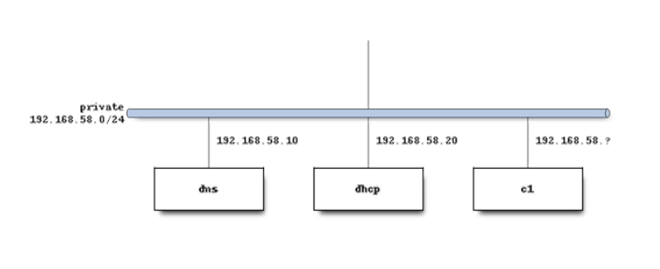

# Practice 3 -- Dynamic DNS

The aim of this practice is to create a dynamic DNS using a three virtual machines: DHCP server, DNS server and a client.



------------------------------------------------------------------------

**Author:**\
Daniel Sánchez Cabello

**Course/Subject:** 2º ASIR B -- Network Services and Internet\
**Finish date:** 

------------------------------------------------------------------------

## Index

1.  [Objective and procedure](#1-objective-and-procedure)

2.  [Vagrantfile Creation and VM's Network Configuration](#1-vagrantfile-creation-and-vms-network-configuration)
    1.  [DHCP Server](#11-dhcp-server)
    2.  [DNS Server](#12-dns-server)
    3.  [Client](#13-client)
    4.  [Vagrantfile final result](#14-vagrantfile-final-result)

3.  [Ansible files configuration](#2-ansible-files-configuration)
    1.  [Creating Ansible configuration file](#21-creating-ansible-configuration-file)
    2.  [Creating the inventory](#22-creating-the-inventory)
    3.  [Creating the playbook](#23-creating-the-playbook)

4.  [Verification](#3-verification)
    1.  [Deploy of the playbook](#31-deploy-of-the-playbook)
    2.  [Verifying addresses](#32-verifying-addresses)


------------------------------------------------------------------------

## 1. Objecctive 

This practice focuses on the creation of a DDNS (Dynamic Domain Name Server). To do that we will use the following technologies:

-   Vagrant: VM creation and general configuration.
-   Ansible: provision for the machines using an inventory and a playbook for each machine.
-   Bash: to create a running-order script to deploy everything and to configure a few other things.

The practice can be done in multiple ways, but I tried to do it as automated as possible trying to do almost everything through Ansible playbooks. Finally, I couldn't manage to do it 100% automated but it works and the user will only need to enter the VMs to modify a few things.

------------------------------------------------------------------------

## 2. Vagrantfile Creation and VM's Network Configuration

The first step is to tell Vagrant the box that we will use, in this case
`debian/bullseye64`.

### 2.1 DHCP Server

Then we create the first VM called **server** and configure the network
interface:

-   **Internal network** -- `192.168.57.10` → to communicate locally with the DNS server and the client.

We won't add a provision path here. I'll talk about it in the running-order.

------------------------------------------------------------------------

### 2.2 DNS Server

Here we must do the same that we did with the DHCP Server.

The only change will be the name and the IP address.

------------------------------------------------------------------------

### 1.3 Client

For the client, do the same but set the IP to "dhcp". Also, here we will add the client provision because wi will provision it when we create the client machine.

------------------------------------------------------------------------

### 1.4 Vagrantfile

This is the full vagrantfile for this practice.

<details><summary>Vagrantfile</summary>

```ruby
    # -*- mode: ruby -*-
    # vi: set ft=ruby :
    Vagrant.configure("2") do |config|
    config.vm.box = "debian/bullseye64"

    #Creación servidor DHCP 
    config.vm.define "dhcp-server" do |server|
        server.vm.hostname = "dhcp-server"
        server.vm.network "private_network", 
                ip: "192.168.57.10", 
                virtualbox__intnet: "intNet1",
                auto_config: true
    end

    #Creacion servidor DNS
    config.vm.define "dns-server" do |dns|
        dns.vm.hostname = "dns-server"
        dns.vm.network "private_network",
                ip: "192.168.57.20",
                virtualbox__intnet: "intNet1",
                auto_config: true
    
    end


    #Cliente 1
    config.vm.define "c1" do |c1|
        c1.vm.hostname = "c1"
        c1.vm.network "private_network",
                    virtualbox__intnet: "intNet1",
                    type: "dhcp"
        c1.vm.provision "ansible" do |ansible|
        ansible.playbook = "playbooks/client.yaml"
        ansible.inventory_path = "inventory.yaml"
        end
    end

    end

```
</details>

## 2. Ansible files configuration

The provision will be done using Ansible. First,, create and configure the config file, then the inventory and then the playbooks.

------------------------------------------------------------------------

### 2.1 Creating Ansible configuration file 

Here we must include the general configuration for Ansible. For example we can set the path for the inventory that will be used for all the playbooks, so the we do not need to specificate. If we had different inventories, then we should not include any of the here. Also we can set the remote user and other parameters.

File: `ansible.cfg`

<details><summary>Ansible configuration</summary>

``` ini

    [defaults]
    inventory = ./inventory.yaml
    remote_user = vagrant
    host_key_checking = False
    deprecation_warnings=False
    retry_files_enabled=False

```
</details>

------------------------------------------------------------------------

### 2.2 Creating the inventory

The inventory is used to have an organized list of the machines we will have and their general connection details, such as the IP, port, or key. We could have used Vagrant’s generic key for all the machines and included it under the vars section, where general parameters are set, but in this case, I assigned each machine the path to the key stored in its own files.

File: `inventory.yaml`

<details><summary>Inventory</summary>

``` yaml

    all:
    vars:
        ansible_user: vagrant
        ansible_python_interpreter: /usr/bin/python3
    
    children:
        servers:
        hosts:
            dhcp-server:
            ansible_host: 127.0.0.1
            ansible_port: 2200
            ansible_private_key_file: .vagrant/machines/dhcp-server/virtualbox/private_key
            dns-server:
            ansible_host: 127.0.0.1
            ansible_port: 2222
            ansible_private_key_file: .vagrant/machines/dns-server/virtualbox/private_key

        clients:
        hosts:
            c1:
            ansible_host: 127.0.0.1
            ansible_port: 2201
            ansible_private_key_file: .vagrant/machines/c1/virtualbox/private_key

```
</details>

------------------------------------------------------------------------

### 2.3 Creating the playbooks

### DNS Server playbook

explicacion

File: `playbooks/dns-server.yaml`

<details><summary>DNS Server</summary>

```yml

    ---
    - name: Configure DNS Server
    hosts: dns-server
    become: true
    tasks:
        - name: Update apt cache
        ansible.builtin.apt:
            update_cache: true

        - name: Install DNS server tools
        ansible.builtin.apt:
            name:
            - bind9
            - bind9utils
            - bind9-doc
            - dnsutils
            state: present

        - name: Generate TSIG key if not exists
        ansible.builtin.command: tsig-keygen -a hmac-sha256 ddns-key
        args:
            creates: /etc/bind/ddns.key
        register: tsig_key
        notify: Save TSIG key

        - meta: flush_handlers # forzar a llamar al handler pq si no se ejecuta al final
        - name: Read TSIG key from file # lee y convierte a base64 el archivo pq no lee texto plano
        ansible.builtin.slurp:
            src: /etc/bind/ddns.key
        register: keyfile

        - name: Add key definition to named.conf.options
        ansible.builtin.blockinfile:
            path: /etc/bind/named.conf.options
            insertafter: EOF
            marker: "# {mark} ANSIBLE DDNS KEY" # para que no duplique el contenido
            block: "{{ (keyfile.content | b64decode).strip() }}" # decodeamos y ponemos el contenido tal cual estaba

        - name: Configure local zones
        ansible.builtin.copy:
            dest: /etc/bind/named.conf.local
            content: |
            zone "danisc.es" IN {
                type master;
                file "/etc/bind/db.danisc.es";
                allow-update { key "ddns-key"; };
            };

            zone "57.168.192.in-addr.arpa" IN {
                type master;
                file "/etc/bind/db.192";
                allow-update { key "ddns-key"; };
            };

        - name: Create forward zone file
        ansible.builtin.copy:
            dest: /etc/bind/db.danisc.es
            content: |
            $TTL    604800
            @       IN      SOA     dns-server.danisc.es. root.danisc.es. (
                                    2         ; Serial
                                    604800    ; Refresh
                                    86400     ; Retry
                                    2419200   ; Expire
                                    604800 )  ; Negative Cache TTL
            ;
            @       IN      NS      dns-server.danisc.es.
            dns-server   IN  A      192.168.57.20

        - name: Create reverse zone file
        ansible.builtin.copy:
            dest: /etc/bind/db.192
            content: |
            $TTL    604800
            @       IN      SOA     dns-server.danisc.es. root.danisc.es. (
                                    2         ; Serial
                                    604800
                                    86400
                                    2419200
                                    604800 )
            ;
            @       IN      NS      dns-server.danisc.es.
            20      IN      PTR     dns-server.danisc.es.

        - name: Check BIND9 configuration
        ansible.builtin.command: named-checkconf

        - name: Restart BIND9
        ansible.builtin.service:
            name: bind9
            state: restarted
            enabled: true

    handlers: # en lugar de usar el when, usamos el handler para llamr al modulo save tsig key
        - name: Save TSIG key
        ansible.builtin.copy:
            dest: /etc/bind/ddns.key
            content: "{{ tsig_key.stdout }}"
            owner: bind
            group: bind
            mode: "0600"


```
</details>

### DHCP Server playbook

explicacion

File: `playbooks/dhcp-server.yaml`

<details><summary>DHCP Server</summary>

```yml

    ---
    - name: Configure DHCP Server
    hosts: dhcp-server
    become: true
    tasks:
        - name: Update apt cache
        ansible.builtin.apt:
            update_cache: true

        - name: Install DHCP server tools
        ansible.builtin.apt:
            name:
            - isc-dhcp-server
            - net-tools
            - iproute2
            state: present

        - name: Configure DHCP server interface
        ansible.builtin.lineinfile:
            path: /etc/default/isc-dhcp-server
            regexp: "^INTERFACESv4="
            line: 'INTERFACESv4="eth1"' # ha hecho falta poner este nombre en lugar de enp0sX porque fallaba

        - name: Fetch TSIG key from DNS server
        ansible.builtin.fetch:
            src: /etc/bind/ddns.key
            dest: /tmp/ddns.key
            flat: true
        delegate_to: dns-server

        - name: Copy TSIG key to DHCP server
        ansible.builtin.copy:
            src: /tmp/ddns.key
            dest: /etc/dhcp/ddns.key
            owner: root
            group: root
            mode: '0600'

        - name: Deploy DHCP configuration
        ansible.builtin.copy:
            dest: /etc/dhcp/dhcpd.conf
            owner: root
            group: root
            mode: "0644"
            content: |
            default-lease-time 86400;
            max-lease-time 691200;
            authoritative;

            option domain-name "danisc.es";
            option domain-name-servers 192.168.57.20;

            subnet 192.168.57.0 netmask 255.255.255.0 {
                range 192.168.57.30 192.168.57.50;
                option routers 192.168.57.10;
                option broadcast-address 192.168.57.255;
            }

            # Para DDNS:
            include "/etc/dhcp/ddns.key";
            ddns-update-style interim;
            ddns-domainname "danisc.es.";
            ddns-rev-domainname "57.168.192.in-addr.arpa.";

            zone danisc.es. {
                primary 192.168.57.20;
                key "ddns-key";
            }

            zone 57.168.192.in-addr.arpa. {
                primary 192.168.57.20;
                key "ddns-key";
            }

        - name: Restart DHCP server
        ansible.builtin.service:
            name: isc-dhcp-server
            state: restarted
            enabled: true


```
</details>


### Client playbook

explicacion

File: `playbooks/client.yaml`

<details><summary>Client</summary>

```yml

    ---
    - name: Configure DHCP Clients
    hosts: clients
    become: true
    tasks:
        - name: Update apt cache
        ansible.builtin.apt:
            update_cache: true

        - name: Install DHCP client tools
        ansible.builtin.apt:
            name:
            - net-tools
            - iproute2
            - isc-dhcp-client
            state: present

        - name: Wait for network to be up
        ansible.builtin.wait_for:
            timeout: 10

        - name: Ensure dhclient requests server-update
        ansible.builtin.lineinfile:
            path: /etc/dhcp/dhclient.conf
            regexp: '^send fqdn\.server-update'
            line: 'send fqdn.server-update true;'
            state: present
            insertafter: '^send fqdn\.fqdn'

        - name: Release any old DHCP leases
        ansible.builtin.command: dhclient -r enp0s8
        ignore_errors: true

        - name: Remove all old dhclient lease files
        ansible.builtin.file:
            path: "{{ item }}"
            state: absent
        loop: "{{ lookup('fileglob', '/var/lib/dhcp/dhclient*.leases', wantlist=True) }}"

        - name: Flush IP addresses on the interface
        ansible.builtin.command: ip addr flush dev enp0s8

        - name: Request new DHCP lease
        ansible.builtin.command: dhclient -v enp0s8
        register: dhclient_result
        changed_when: false
        failed_when: false

        - name: Show DHCP negotiation log
        ansible.builtin.debug:
            msg: "{{ dhclient_result.stdout }}"

        - name: Show current IP addresses
        ansible.builtin.command: ip a
        register: ip_result
        changed_when: false
        failed_when: false

        - name: Show obtained IP
        ansible.builtin.debug:
            msg: "{{ ip_result.stdout }}"


```
</details>

------------------------------------------------------------------------

## 3. Deploy and Test

### 3.1 Running order

In order for the practice to work propperly, I created a script with a specific running order. First, we do "vagrant up" to dns and dhcp servers. Once they are running, we will provision them with Ansible, first the dns server to run bind and the the dhcp server. When this ins ready, we can create the client and provision it.

File: `ordenEjecucion.sh`

<details><summary>Running order</summary>

```bash

    #!/bin/bash
    set -e

    echo "=== Levantando servidores DNS y DHCP ==="
    vagrant up dns-server dhcp-server --no-provision

    echo "=== Provisionando DNS ==="
    ansible-playbook playbooks/dns-server.yaml

    echo "=== Provisionando DHCP ==="
    ansible-playbook playbooks/dhcp-server.yaml

    echo "=== Esperando unos segundos para que los servicios arranquen ==="
    sleep 10

    echo "=== Levantando cliente DHCP ==="
    vagrant up c1 --provision

    echo "=== Todo listo! ==="

```
</details>

### 3.2 Checking the machines and extra configuration

### DNS Server

Now, if there are no errors we must enter each machine and check the status of the processes. Once everything is OK, we can go to the client for example and use dig to check the name resolutions with the dynamic ips.

<details><summary>Server addresses</summary>

```bash


```
</details>

### DHCP Server

explanation

<details><summary>Server addresses</summary>

```bash


```
</details>

### Client

explanation

<details><summary>Server addresses</summary>

```bash


```
</details>


------------------------------------------------------------------------

© Daniel Sánchez Cabello
